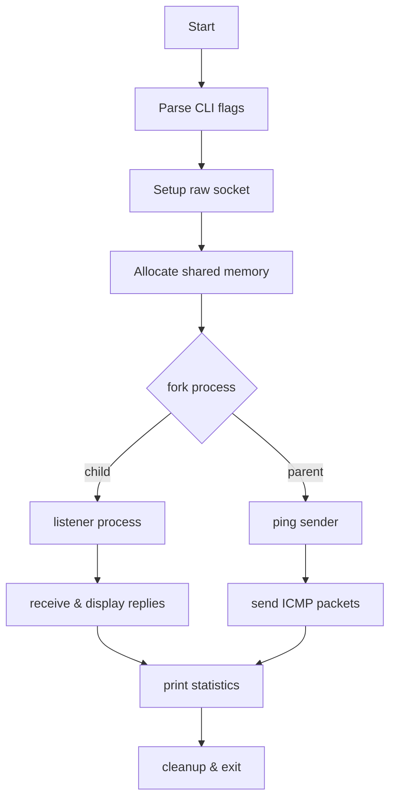

# ping.h

This header declares the function to compute the ICMP checksum used by the ping utility. It provides a clean interface for calculating the one's-complement checksum before sending packets.

```c
/**
 * @brief calculating checksum before sending a packet
 */
unsigned short in_checksum(unsigned short *addr, int count);
```  


| Function        | Description                            |
| --------------- | -------------------------------------- |
| **in_checksum** | Computes the ICMP header checksum over a buffer |

---

# ping.c

This file implements a custom `ping` tool. It sends ICMP echo requests, listens for replies, measures round-trip time (RTT), and prints statistics.

```c
#include <stdio.h>
#include <stdlib.h>
#include <string.h>
#include <arpa/inet.h>
#include <netinet/ip.h>
#include <netinet/ip_icmp.h>
#include <sys/socket.h>
#include <sys/time.h>
#include <errno.h>
#include <poll.h>
#include <unistd.h>
#include <netdb.h>
#include <fcntl.h>
#include <sys/wait.h>
#include <sys/types.h>
#include <signal.h>
#include <sys/mman.h>
#define _POSIX_C_SOURCE 200809L
extern char *optarg;
char *ip_address = NULL;       // IP from -a flag
int packet_sequence = 1;       // ICMP sequence tracker
int flood_flag = 0;            // flood mode (-f)
int sock = -1;                 // raw socket FD
struct protoent *proto = NULL; // ICMP protocol info
#define PACKET_SIZE 64
#define BUFFER_SIZE 1024
#define IP_STR_LENGTH 16
#define TIMEOUT 10000           // in milliseconds
#define MAX 1000000.0
double sum_rtt = 0, min_rtt = 0, max_rtt = 0, avg_rtt = 0;
typedef struct {
    int packets_received;
    double sum_rtt;
    double min_rtt;
    double max_rtt;
} ping_stats_t;
ping_stats_t *shared_stats = NULL;
/* ICMP packet structure */
typedef struct {
    struct icmphdr icmp_header;
    char message[PACKET_SIZE - sizeof(struct icmphdr)];
} icmp_packet;
```  


## Root Privileges Required

```card
{
    "title": "Root Privileges Required",
    "content": "ping.c uses raw sockets and must run as root or with CAP_NET_RAW."
}
```

## Global Variables

| Name              | Type             | Purpose                                    |
| ----------------- | ---------------- | ------------------------------------------ |
| `ip_address`      | `char *`         | Stores the target IP from `-a` flag        |
| `packet_sequence` | `int`            | Tracks the ICMP sequence number            |
| `flood_flag`      | `int`            | Enables flood mode when set               |
| `sock`            | `int`            | Descriptor for the raw socket              |
| `shared_stats`    | `ping_stats_t *` | Shared memory region for RTT statistics    |

## Data Structures

- **icmp_packet**  
  Contains an ICMP header and a payload holding the send timestamp.  
- **ping_stats_t**  
  Tracks number of replies, total RTT, minimum RTT, and maximum RTT.

## Core Functions 🛠️

### set_sockaddr_in

Initializes a `sockaddr_in` structure with the provided IP address.

```c
void set_sockaddr_in(char *ip_addr, struct sockaddr_in *dest_address) {
    memset(dest_address, 0, sizeof(*dest_address));
    dest_address->sin_family = AF_INET;
    dest_address->sin_port   = 0;
    if (inet_pton(AF_INET, ip_addr, &dest_address->sin_addr) <= 0) {
        perror("Invalid IP Address");
        exit(EXIT_FAILURE);
    }
}
```  


### set_packet

Prepares an ICMP Echo Request by setting type, code, identifier, sequence, timestamp, and checksum.

```c
void set_packet(icmp_packet *p_packet) {
    memset(p_packet, 0, sizeof(*p_packet));
    p_packet->icmp_header.type     = ICMP_ECHO;
    p_packet->icmp_header.code     = ICMP_ECHO_CODE;
    p_packet->icmp_header.un.echo.id       = getpid();
    p_packet->icmp_header.un.echo.sequence = htons(packet_sequence++);
    struct timeval tv; gettimeofday(&tv, NULL);
    memcpy(p_packet->message, &tv, sizeof(tv));
    p_packet->icmp_header.checksum =
        checksum(p_packet, sizeof(*p_packet));
}
```  


### ping

Configures socket options (TTL and receive timeout) then sends the specified number of ICMP packets. It respects flood mode.

```c
void ping(struct sockaddr_in *address, int count) {
    int ttl = 255;
    setsockopt(sock, SOL_IP, IP_TTL, &ttl, sizeof(ttl));
    struct timeval to = { .tv_sec = TIMEOUT/1000, .tv_usec = 0 };
    setsockopt(sock, SOL_SOCKET, SO_RCVTIMEO, &to, sizeof(to));
    for (int i = 0; i < count; i++) {
        set_packet(&packet);
        sendto(sock, &packet, sizeof(packet), 0,
               (struct sockaddr*)address, sizeof(*address));
        if (!flood_flag) sleep(1);
    }
}
```  


### listener

Waits for incoming ICMP replies using `poll`. On receipt, it calls `display`.

```c
void listener(void) {
    struct pollfd pfd = { .fd = sock, .events = POLLIN };
    unsigned char buffer[BUFFER_SIZE];
    while (1) {
        if (poll(&pfd, 1, TIMEOUT) <= 0) break;
        int bytes = recvfrom(sock, buffer, sizeof(buffer), 0, NULL, NULL);
        if (bytes > 0) display((char*)buffer, bytes);
    }
}
```  


### display

Parses the raw packet, extracts IP and ICMP headers, computes RTT, updates statistics, and prints output.

```c
void display(char *buffer, int bytes) {
    struct iphdr *ip   = (struct iphdr*)buffer;
    struct icmphdr *ic = (struct icmphdr*)(buffer + ip->ihl*4);
    struct timeval sent, recv;
    memcpy(&sent, buffer + ip->ihl*4 + sizeof(*ic), sizeof(sent));
    gettimeofday(&recv, NULL);
    double rtt = get_round_trip_time(&sent, &recv);
    if (ic->type == ICMP_ECHOREPLY) {
        shared_stats->packets_received++;
        shared_stats->sum_rtt += rtt;
        set_min(rtt); set_max(rtt);
        char src[IP_STR_LENGTH];
        inet_ntop(AF_INET, &ip->saddr, src, sizeof(src));
        printf("%d bytes from %s: icmp_seq=%d ttl=%d time=%.3f ms\n",
               ntohs(ip->tot_len), src,
               ntohs(ic->un.echo.sequence), ip->ttl, rtt);
    }
}
```  


### checksum

Calculates the one's-complement checksum over a buffer of bytes.

```c
unsigned short checksum(void *b, int len) {
    uint16_t *buf = b; unsigned int sum = 0;
    while (len > 1) { sum += *buf++; len -= 2; }
    if (len == 1) sum += *(uint8_t*)buf;
    sum = (sum >> 16) + (sum & 0xFFFF);
    sum += (sum >> 16);
    return ~sum;
}
```  


### set_min & set_max

Update the shared minimum and maximum RTT values.

```c
void set_min(double rtt) {
    if (rtt < shared_stats->min_rtt) shared_stats->min_rtt = rtt;
}
void set_max(double rtt) {
    if (rtt > shared_stats->max_rtt) shared_stats->max_rtt = rtt;
}
```  


### get_round_trip_time

Returns the RTT in milliseconds between two `timeval` structs.

```c
double get_round_trip_time(struct timeval *start, struct timeval *end) {
    long sec  = end->tv_sec - start->tv_sec;
    long usec = end->tv_usec - start->tv_usec;
    if (usec < 0) { usec += 1000000; sec -= 1; }
    return sec * 1000.0 + usec / 1000.0;
}
```  


### main

Parses CLI flags (`-a`, `-c`, `-f`), sets up raw socket, allocates shared memory, forks into listener and sender, then prints statistics and cleans up.

```c
int main(int argc, char *argv[]) {
    struct sockaddr_in dest;
    int loops = 1, opt;
    while ((opt = getopt(argc, argv, "a:c:f")) != -1) { ... }
    proto = getprotobyname("ICMP");
    sock  = socket(PF_INET, SOCK_RAW, proto->p_proto);
    set_sockaddr_in(ip_address, &dest);
    shared_stats = mmap(...);
    pid_t pid = fork();
    if (pid == 0)      listener();
    else { ping(&dest, loops); sleep(1); }
    // print summary from shared_stats
    kill(pid, SIGKILL); wait(NULL);
    return 0;
}
```  


## Execution Flow 💡



This structure clarifies how `ping.c` orchestrates sending and receiving ICMP messages in parallel, using shared memory to coordinate statistics.
